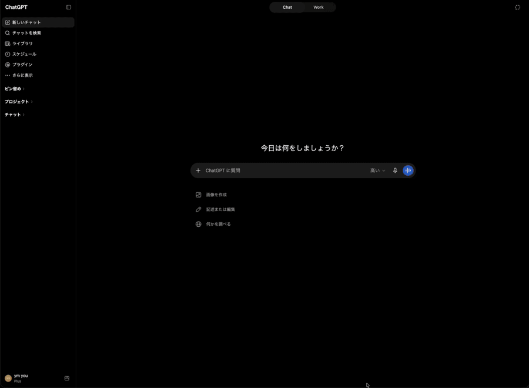

# Yahoo! Shopping MCP（日本語）

Yahoo!ショッピング商品検索API v3を利用する、コミュニティ開発のオープンソースMCPサーバーです。MCPのStreamable HTTPで読み取り専用の商品検索を提供します。

このプロジェクトはYahoo!ショッピング、LINEヤフー株式会社、OpenAIの公式サービスではありません。提携、承認、保証、公式実装であることを示すものではありません。

## 公開方針と免責

このリポジトリは自分で運用することを前提にしており、開発者が共有ホストや本番用の公開エンドポイントを保証するものではありません。

開発者が別途共有するCloudflare TunnelのURLがある場合、それは検証用の一時的なURLです。停止、再起動、変更、終了する可能性があり、稼働率、SLA、サポート、プライバシー、データ保持は保証されません。本番利用や機密情報を扱う用途には使用せず、自分が管理するインフラへデプロイしてください。

現在、サンプルアプリケーションの接続確認用として次のURLを案内しています。

- MCPエンドポイント: <https://non-official-yahoo-shopping-mcp.notelligent.app/mcp>
- ヘルスチェック: <https://non-official-yahoo-shopping-mcp.notelligent.app/healthz>
- ルートヘルスチェック: <https://non-official-yahoo-shopping-mcp.notelligent.app/>

これらはデモ・疎通確認専用のURLです。Yahoo!やOpenAIの公式サービスではなく、常時稼働、安定性、サポート、プライバシー、特定利用者への提供は保証されません。本番利用や機密情報を扱う用途には使用せず、自分でホストしてください。

登録先と掲載状態の記録は [公開・掲載台帳](PUBLICATION.md) にまとめています。

これはコミュニティによる実装です。利用前に、利用者自身でYahoo!デベロッパーネットワークおよびYahoo!ショッピングAPIの最新の規約、クォータ、帰属表示、コンテンツ制限、適用される法令を確認してください。開発者は第三者規約への適合や利用方法を保証しません。

## デモ

ChatGPTからYahoo!ショッピングを検索し、MCP Appsの商品カルーセルを表示する短いデモです。



GitHubのMarkdownではリポジトリ内のMP4を安定してインライン再生できないため、READMEではGIFを表示しています。高画質版のMP4は [assets/demo.mp4](../assets/demo.mp4) から取得できます。

## 必要なものとローカル起動

- Python 3.12以上
- `uv`
- 利用者自身が取得したYahoo!ショッピングAPIの`appid`

```bash
make sync-dev
YAHOO_SHOPPING_APP_ID="your-app-id" make run
```

既定のエンドポイントは次のとおりです。

- MCP: `http://127.0.0.1:8000/mcp`
- ヘルスチェック: `http://127.0.0.1:8000/healthz`

このサーバーはMCP認証を実装していません。既定ではloopbackに bind されるため、起動しただけでインターネットへ公開されるわけではありません。公開時は、ネットワーク、リバースプロキシ、レート制限、ログ、データ保持を利用者自身で設定してください。

## Docker・本番セルフホスト

```bash
make init-env
make up
```

Composeのローカルエンドポイントは`http://127.0.0.1:18000/mcp`です。会社や本番環境で利用する場合のコンテナ、リバースプロキシ、Host/Origin設定は [Deployment](DEPLOYMENT.md) を参照してください。

直接起動する場合は`YAHOO_SHOPPING_MCP_*`環境変数を使用します。Composeでは利便性のため`ALLOWED_HOSTS`と`ALLOWED_ORIGINS`をアプリケーションの設定へ変換します。

## 任意のCloudflare Tunnel

Cloudflare Tunnelは任意の開発者向け公開手段であり、必須ではありません。

```bash
make up-tunnel
```

このプロファイルを使う場合だけ`CLOUDFLARE_TUNNEL_TOKEN`を設定します。Tunnelのホスト名と公開先はCloudflare側で管理されるため、実際に利用する外部ホスト名を`ALLOWED_HOSTS`と`ALLOWED_ORIGINS`へ指定してください。

```env
YAHOO_SHOPPING_APP_ID=replace-with-your-yahoo-app-id
CLOUDFLARE_TUNNEL_TOKEN=replace-with-your-cloudflare-tunnel-token
ALLOWED_HOSTS=mcp.example.com
ALLOWED_ORIGINS=https://mcp.example.com
```

開発者が使う検証用TunnelのURLを、利用者向けの常時稼働サービスや公式サービスとみなさないでください。継続利用には自分のサーバー、ドメイン、Tunnelまたはリバースプロキシを用意してください。

## MCPプロトコルと利用方法

MCPのStreamable HTTPを`/mcp`で提供します。`GET /`と`GET /healthz`はヘルスチェックです。`search_products`は`query`または`jan_code`の少なくとも一方を必要とします。

主な入力制約は次のとおりです。

- `query`: 1～200文字
- `jan_code`: 8～13桁の数字文字列
- `genre_category_ids`、`brand_ids`: 1～20個の正の整数
- `results`: 1～50
- `start`: 1以上
- `start + results <= 1000`
- 両方指定した場合の`price_from <= price_to`

完全な入力・出力仕様は [API仕様](API.md) を参照してください。商品データは`content[0].text`の`results`に、カルーセル用データは`structuredContent.products`に返します。

## 安全性・プライバシー・規約

このサーバーは検索専用で、購入、注文、決済、アカウント変更は行いません。商品分類フィルタは保守的な実装であり、完全な分類や法令遵守を保証するものではありません。

検索語は運用者のMCPサーバーとYahoo!ショッピングへ送信されます。秘密情報、決済情報、パスワード、政府識別子、機微な個人情報を検索語に含めないでください。

- [プライバシー通知](../PRIVACY.md)
- [利用上の注意](../TERMS.md)
- [セキュリティ方針](../SECURITY.md)
- [データ取り扱い](DATA_HANDLING.md)

Yahoo!デベロッパーネットワークの公式情報:

- [ガイドライン](https://developer.yahoo.co.jp/guideline/)
- [Yahoo!ショッピングAPI](https://developer.yahoo.co.jp/webapi/shopping/)
- [商品検索 v3 API仕様](https://developer.yahoo.co.jp/webapi/shopping/v3/itemsearch.html)
- [クレジット表示](https://developer.yahoo.co.jp/attribution/)
- [利用制限](https://developer.yahoo.co.jp/appendix/rate.html)
- [ご利用ガイド・Client ID登録](https://developer.yahoo.co.jp/start/)

これらの規約・ガイドラインはリポジトリのライセンスに含まれません。各利用者が最新の内容を確認し、自分のClient ID、利用方法、クレジット表示、クォータ、法令遵守について責任を負います。

## 開発・検証

```bash
make test
```

テストはYahoo!へ実通信せず、`httpx.MockTransport`を使用します。MCP InspectorとMCP Apps UIの確認は [検証手順](VERIFICATION.md) を参照してください。変更への参加方法は [CONTRIBUTING.md](../CONTRIBUTING.md) を参照してください。

サポートは [SUPPORT.md](../SUPPORT.md)、脆弱性の報告は [SECURITY.md](../SECURITY.md) の非公開手順を利用してください。

## ライセンス

[MIT](../LICENSE)
